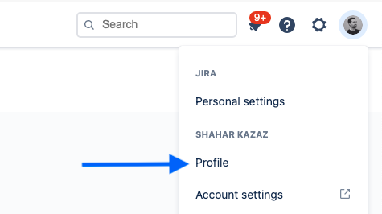

# jiranch
Easily create git branches from Jira issues

The cli has 3 commands: 
- `init` - Create the configuration file.
- `createBranch` (default) - Create branch from Jira issue.
- `clear` - Delete the saved configuration.

```bash
npx jiranch init
```

## Init

Create Jira token here: https://id.atlassian.com/manage/api-tokens

Steps to get your user id: 

1. Click on your Jira user picture:
   
2. Go to "Profile":
   
3. Take the last part from the URL, this is your user id: `jira/people/${userId}`
